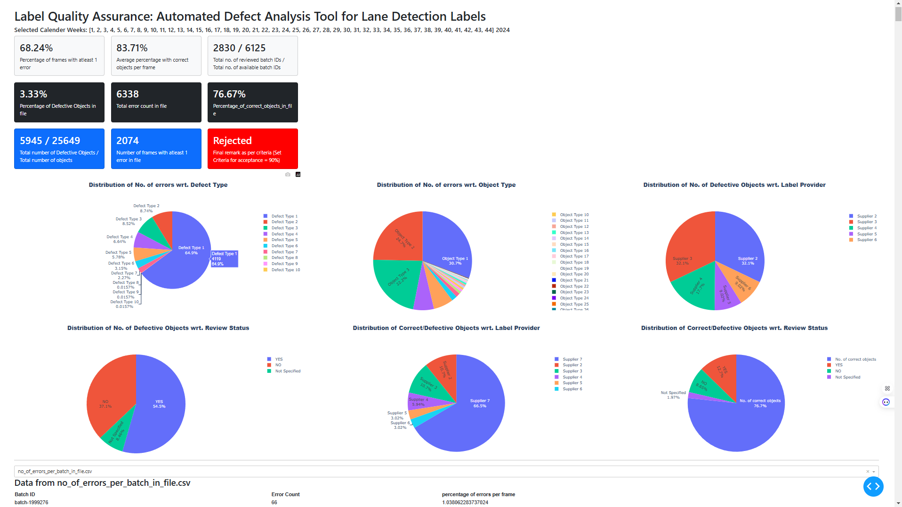
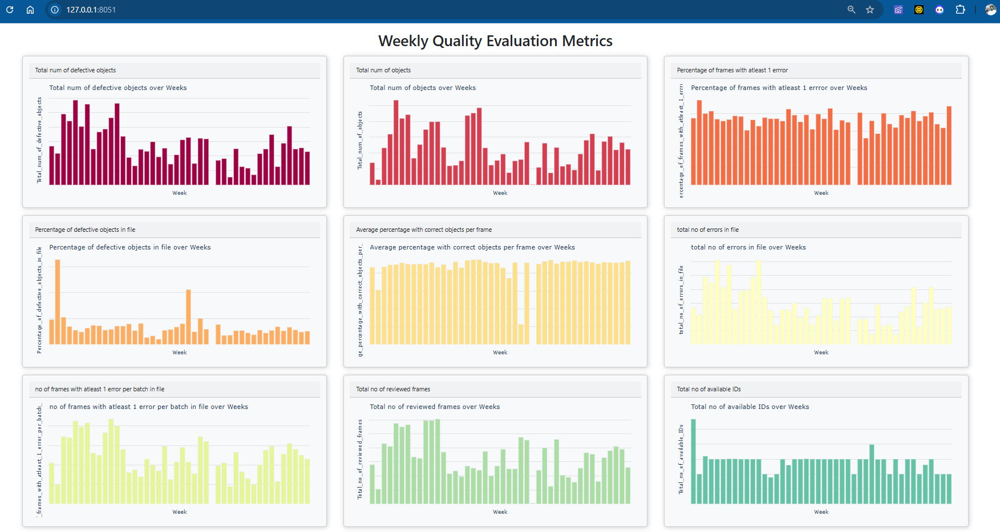
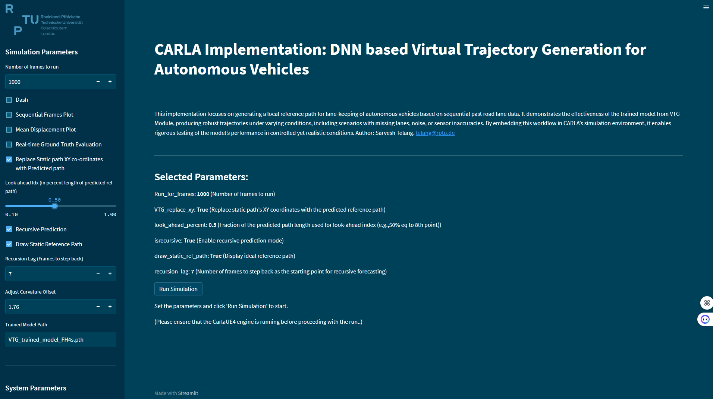
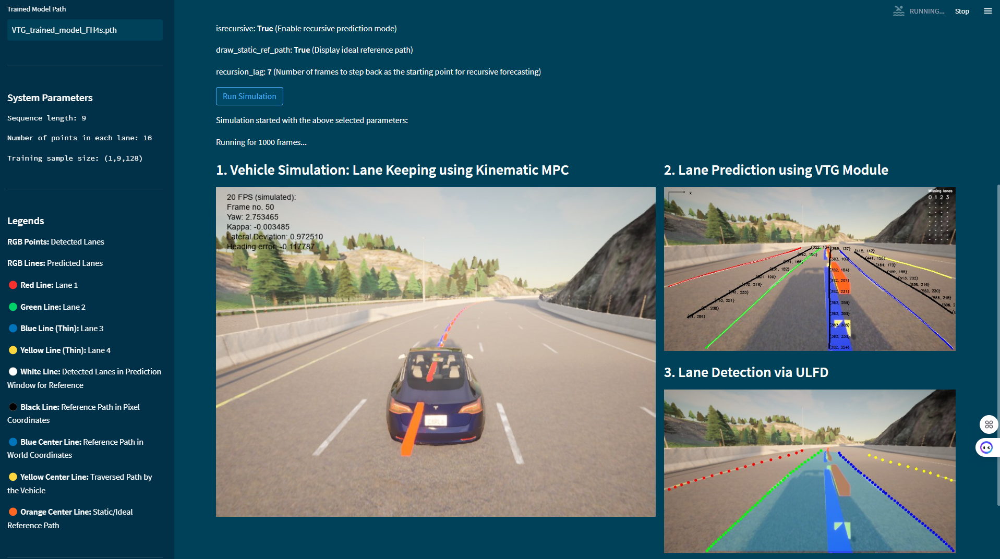
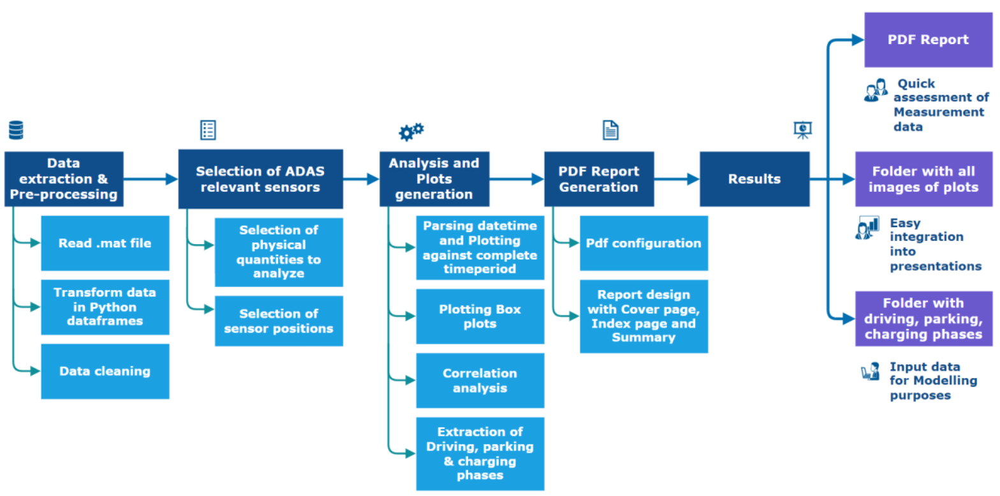
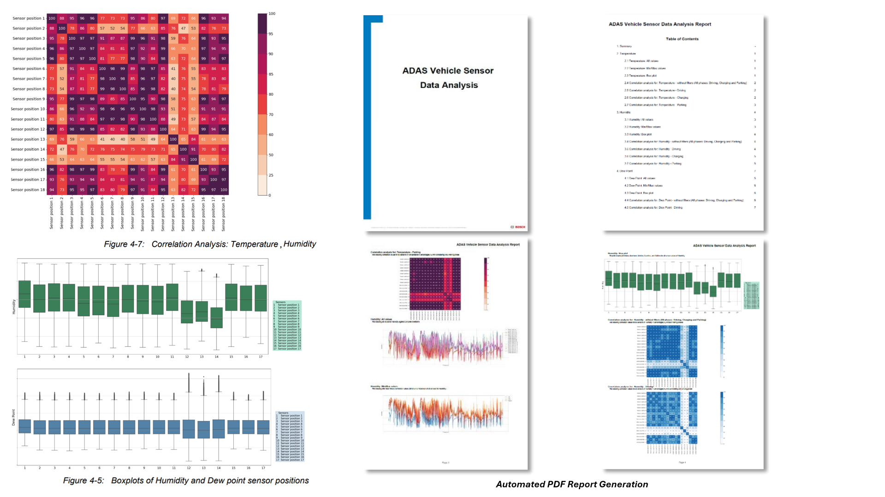
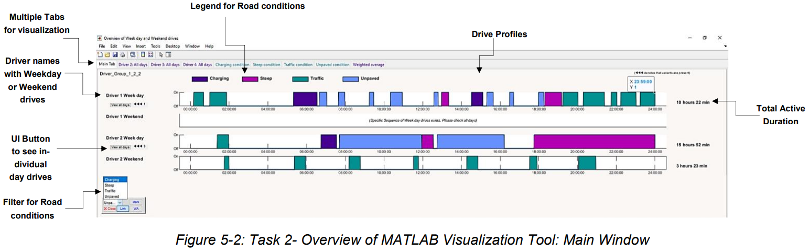

# Data-Analysis-and-Visualization-Projects
Note: All data and numeric values have been either manipulated or hidden to maintain confidentiality.

## 1. Label Quality Assurance: Tool for Label Defect Analysis from Multiple Label Suppliers
This project focuses on analyzing label defects across various suppliers to ensure quality standards. The tool was developed during working student role at Bosch.

##### Defect Analysis Dashboard
Dashboard showcasing defect trends over time.

##### Weekwise Evaluation
Visualization of week-by-week evaluations conducted within a year.

## 2. Streamlit Web Application Displaying Vehicle Simulation from CARLA Simulator
Developed a Streamlit-based web application to visualize vehicle simulations generated using the CARLA simulator during master’s thesis.

##### Web Application: User Interface
Interactive user interface for controlling simulation parameters.

##### Simulation Video Integration
Integrated video playback for simulating real-time lateral motion control of an autonomous vehicle.

## 3. ADAS Vehicle Sensor Data Analysis
Conducted an in-depth analysis of ADAS sensor data to support autonomous driving research during internship at Bosch.

##### Overall Pipeline
Pipeline overview for processing and analyzing sensor data.

##### PDF Report Generation
Automated PDF reports generated for the analysis performed on user-selected sensors.

## 4. MATLAB Tool for Visualization of Driving Profiles
Created a MATLAB tool for visualizing and analyzing vehicle driving profiles using UI panels and buttons.

##### Tool User Interface
User-friendly interface displaying driving profiles over different times of the year, with filter options.

